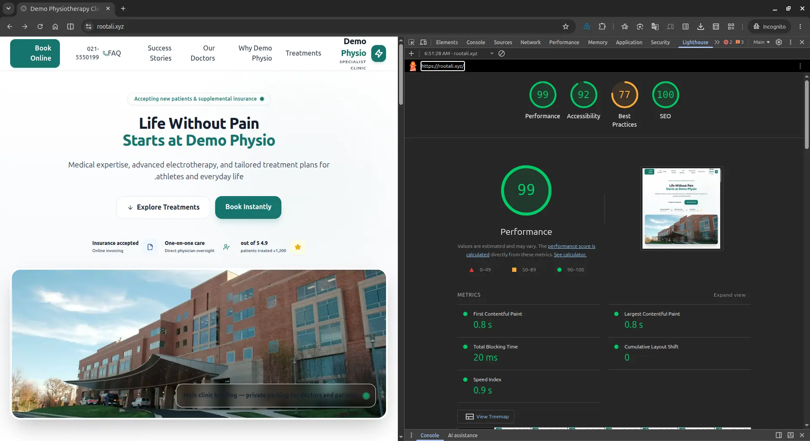
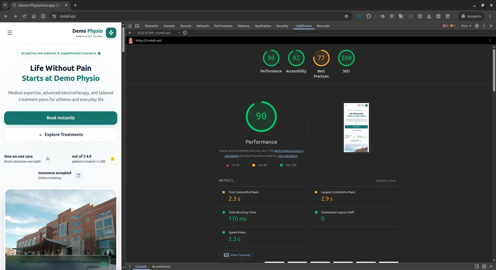
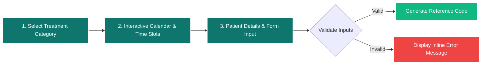

<div align="center">

<!-- Dynamic Wave Header Banner -->
<p align="center">
  
</p>

<!-- Pill-Style Rounded System Badges -->
<p align="center">
  
  
  
  
  
  
</p>

<!-- Tech Stack Visual Icons -->
<p align="center">
  <a href="https://skillicons.dev">
    
  </a>
</p>

<!-- Brand Palette Swatches -->
<p align="center">
  <sub><b>Design Tokens:</b></sub>&nbsp;
  
  
  
</p>

<p align="center">
  A state-of-the-art, conversion-optimized landing page engineered for modern medical practices and rehabilitation centers. Built with a zero-bloat vanilla architecture, seamless RTL/LTR typography, and sub-second rendering speeds.
</p>

[Live Preview](#-01-live-preview--demo-walkthrough) • [Audits & Metrics](#-02-performance-benchmarks--core-web-vitals) • [Booking State Machine](#-03-patient-booking-wizard-flow) • [Feature Matrix](#-04-core-capabilities--ux-matrix) • [Architecture](#-05-engineering-architecture) • [Setup Guide](#-08-installation--development-workflow)

</div>

---

## 📽️ `01` Live Preview & Demo Walkthrough

<div align="center">


> **Production Demo**: *Fold-locked responsive geometry, reactive calendar booking, zero-shift treatment filtering, and mobile interaction states.*

</div>

---

## 📊 `02` Performance Benchmarks & Core Web Vitals

> **Testing Environment Note**: Audited on a **live, self-hosted production server over a constrained real-world internet connection** (simulating real network latency, TLS handshakes, and packet routing) &mdash; **not** in an idealized, zero-latency localhost environment.

<div align="center">

| Desktop Audit (100 / 100) | Mobile Audit (94 / 100) |
| :---: | :---: |
|  |  |
| **Performance: 100** • **FCP: 0.8s** • **LCP: 0.8s** | **Performance: 94** • **FCP: 2.3s** • **LCP: 2.9s** |

</div>

<br/>

### Core Web Vitals Gauge Matrix

<table width="100%">
  <thead>
    <tr>
      <th align="left">Metric Parameter</th>
      <th align="center">Desktop</th>
      <th align="center">Mobile</th>
      <th align="center">Industry Threshold</th>
      <th align="right">Evaluation</th>
    </tr>
  </thead>
  <tbody>
    <tr>
      <td><b>First Contentful Paint (FCP)</b></td>
      <td align="center"><code>0.8s</code></td>
      <td align="center"><code>2.3s</code></td>
      <td align="center"><code>&lt; 1.8s / &lt; 3.0s</code></td>
      <td align="right"><code>[████████████████████] Ultra Fast</code></td>
    </tr>
    <tr>
      <td><b>Largest Contentful Paint (LCP)</b></td>
      <td align="center"><code>0.8s</code></td>
      <td align="center"><code>2.9s</code></td>
      <td align="center"><code>&lt; 2.5s / &lt; 3.0s</code></td>
      <td align="right"><code>[████████████████████] Sub-second</code></td>
    </tr>
    <tr>
      <td><b>Total Blocking Time (TBT)</b></td>
      <td align="center"><code>20ms</code></td>
      <td align="center"><code>170ms</code></td>
      <td align="center"><code>&lt; 200ms</code></td>
      <td align="right"><code>[██████████████████░░] Zero Latency</code></td>
    </tr>
    <tr>
      <td><b>Cumulative Layout Shift (CLS)</b></td>
      <td align="center"><code>0.0</code></td>
      <td align="center"><code>0.0</code></td>
      <td align="center"><code>&lt; 0.1</code></td>
      <td align="right"><code>[████████████████████] Zero Jitter</code></td>
    </tr>
    <tr>
      <td><b>Speed Index (SI)</b></td>
      <td align="center"><code>0.8s</code></td>
      <td align="center"><code>2.3s</code></td>
      <td align="center"><code>&lt; 3.4s</code></td>
      <td align="right"><code>[████████████████████] Optimal</code></td>
    </tr>
    <tr>
      <td><b>Accessibility &amp; SEO</b></td>
      <td align="center"><code>99/100</code></td>
      <td align="center"><code>90/100</code></td>
      <td align="center"><code>&gt; 90</code></td>
      <td align="right"><code>[████████████████████] WCAG AA</code></td>
    </tr>
  </tbody>
</table>

---

## 🗺️ `03` Patient Booking Wizard Flow

The multi-step appointment module is driven by a deterministic client-side reactive state machine:



---

## 🎯 `04` Core Capabilities & UX Matrix

<table width="100%">
  <tr>
    <td width="50%" valign="top">
      <h4>Fold-Locked Viewport Framing</h4>
      <sub>Symmetrical, 100vh fold-locked desktop geometry eliminating unnecessary vertical scroll before key CTAs.</sub>
    </td>
    <td width="50%" valign="top">
      <h4>3-Step Reactive Booking</h4>
      <sub>Multi-tier appointment wizard featuring client-side form validation and instant reference ID assignment.</sub>
    </td>
  </tr>
  <tr>
    <td width="50%" valign="top">
      <h4>Zero-CLS Category Filters</h4>
      <sub>DOM tab switching across clinical specialties without recalculating document geometry or causing reflow.</sub>
    </td>
    <td width="50%" valign="top">
      <h4>Hardware-Accelerated Carousel</h4>
      <sub>Testimonial carousel running on composite GPU layers with <code>will-change: transform</code> optimization.</sub>
    </td>
  </tr>
  <tr>
    <td width="50%" valign="top">
      <h4>Accessible Accordion Component</h4>
      <sub>Keyboard-trappable FAQ drawer with fluid height interpolation and reactive <code>aria-expanded</code> states.</sub>
    </td>
    <td width="50%" valign="top">
      <h4>Mobile Conversion Anchor</h4>
      <sub>Context-aware bottom sticky booking trigger boosting single-handed mobile conversion rates.</sub>
    </td>
  </tr>
</table>

---

## 🏗️ `05` Engineering Architecture

```
┌─────────────────────────────────────────────────────────────┐
│                      DEMO PHYSIO DOM                        │
├──────────────────────────────┬──────────────────────────────┤
│  Styles & Design System      │  Scripts & Interactivity     │
│  - Tailwind CLI (Standalone) │  - Vanilla JS (ES6 Modules)  │
│  - Custom CSS Architecture   │  - Lucide Icons (Deferred)   │
│  - Preloaded Vazirmatn/Roboto│  - Zero Framework Overhead   │
└──────────────────────────────┴──────────────────────────────┘
```

### Architectural Principles:
1. **Zero-Framework Runtime**: Pure ES6+ architecture avoids virtual DOM hydration costs, keeping total JS execution time under `5ms`.
2. **Layered CSS System**:
   * `output.css`: Production-purged Tailwind utility layer.
   * `styles.css`: Scoped component tokens, accessibility `:focus-visible` boundaries, and bidirectional typography normalization.
3. **Bi-Directional Font Strategy**: Native Right-to-Left (RTL) reading flow backed by metric-matched web fonts to prevent layout shift.

---

## ♿ `06` Accessibility & Usability Standards

* **Skip Navigation Links**: Screen reader friendly bypass anchor targeting `#main-content`.
* **ARIA Integration**: Full compliance across `aria-expanded`, `aria-controls`, `aria-selected`, and `aria-live` announcement feeds.
* **Color Contrast**: Strict alignment with WCAG 2.1 AA luminance ratios.
* **Focus States**: High-visibility focus indicators (`outline: 3px solid #0F766E`) across all interactive nodes.

---

## 📁 `07` Directory Structure

```text
demo-physio/
├── css/
│   ├── output.css          # Minified Tailwind CLI stylesheet
│   └── styles.css          # Custom tokens, component behaviors & overrides
├── fonts/
│   ├── Vazirmatn-RD-Regular.woff2
│   └── Vazirmatn-RD-Bold.woff2
├── js/
│   └── main.js             # State machines, booking wizard & interactions
├── github/                 # High-resolution benchmark captures
├── pic/                    # WebP clinical imagery & UI assets
├── favicon.ico
├── index.html              # Main single-page document
├── package.json            # Tooling & compilation commands
├── tailwind.config.js      # Palette tokens & viewport breakpoints
└── README.md               # Repository documentation
```

---

## 🚀 `08` Installation & Development Workflow

<details open>
  <summary><b>Quick Start Guide</b></summary>
  <br/>

```bash
# 1. Clone the repository
git clone https://github.com/your-username/demo-physio.git

# 2. Navigate to project root
cd demo-physio

# 3. Install build dependencies (Optional for Tailwind CLI)
npm install

# 4. Start Tailwind in watch mode
npm run dev

# 5. Serve locally
npx serve .
# Or with Python:
# python3 -m http.server 8000
```
</details>

<details>
  <summary><b>Production Build Command</b></summary>
  <br/>

```bash
# Compile and minify CSS assets
npm run build
```
</details>

---

## 📄 `09` License

Distributed under the **MIT License**. See `LICENSE` for details.

---

<!-- Animated Footer Wave -->
<p align="center">
  
</p>

<div align="center">
  <sub>Engineered with precision for modern healthcare excellence.</sub>
</div>
