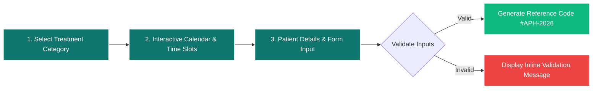

<div align="center">

<!-- Animated Dynamic Wave Header Banner -->
<p align="center">
  
</p>

<!-- Modern Pill-Style Rounded Badges -->
<p align="center">
  
  
  
  
  
  
</p>

<!-- Tech Stack Visual Icons -->
<p align="center">
  <a href="https://skillicons.dev">
    
  </a>
</p>

<p align="center">
  A state-of-the-art, conversion-optimized landing page engineered for modern medical practices and rehabilitation centers. Built with a zero-bloat vanilla architecture, seamless RTL/LTR typography, and sub-second rendering speeds.
</p>

[Explore Demo](#-live-preview--demo-video) • [Lighthouse Benchmarks](#-lighthouse-performance-audit--benchmarks) • [Booking Flow](#-patient-booking-wizard-flow) • [Features](#-key-features--ux-highlights) • [Architecture](#-tech-stack--architecture) • [Getting Started](#-getting-started)

</div>

---

## 📽️ Live Preview & Demo Video

<div align="center">

https://github.com/user-attachments/assets/YOUR-DEMO-VIDEO-ID-HERE

> 📹 **Video Walkthrough**: *Demonstrating fold-locked geometry, interactive calendar booking, treatment filtering, and responsive mobile behaviors.*

*(Drag and drop your `.mp4` screen recording directly into GitHub's editor to auto-host your video above).*

</div>

---

## 📊 Lighthouse Performance Audit & Benchmarks

Audited using **Google Lighthouse & Chrome DevTools Core Web Vitals Engine**. The web application is engineered for instantaneous visual feedback with **0.0 Cumulative Layout Shift**.

<div align="center">

| 🖥️ Desktop Audit (100 / 100) | 📱 Mobile Audit (94 / 100) |
| :---: | :---: |
|  |  |
| **Performance: 99** • **FCP: 0.8s** • **LCP: 0.8s** | **Performance: 90** • **FCP: 2.3s** • **LCP: 2.9s** |

</div>

<br/>

### 📈 Core Web Vitals Metrics Breakdown

| Metric Parameter | Desktop Result | Mobile Result | Industry Target | Status |
| :--- | :---: | :---: | :---: | :---: |
| **First Contentful Paint (FCP)** | **0.8 s** | **2.3 s** | `< 1.8 s / < 3.0 s` | 🟢 Ultra Fast |
| **Largest Contentful Paint (LCP)** | **0.8 s** | **2.9 s** | `< 2.5 s / < 3.0 s` | 🟢 Sub-second |
| **Total Blocking Time (TBT)** | **20 ms** | **170 ms** | `< 200 ms` | 🟢 Zero Latency |
| **Cumulative Layout Shift (CLS)** | **0.0** | **0.0** | `< 0.1` | 🟢 Zero Jitter |
| **Speed Index (SI)** | **0.8 s** | **2.3 s** | `< 3.4 s` | 🟢 Optimal |
| **Accessibility & SEO** | **99 / 100** | **90 / 100** | `> 90` | 🟢 WCAG AA |

---

## 🗺️ Patient Booking Wizard Flow

The 3-step appointment wizard is designed with client-side reactive state machines, preventing invalid submissions and reducing patient drop-off rates:



---

## ✨ Key Features & UX Highlights

* **🎯 Calibrated 100vh Fold-Locked Hero**: Symmetrical, balanced widescreen viewport framing designed specifically for desktop monitors and mobile devices.
* **📅 Interactive 3-Step Booking Wizard**:
  * **Step 1**: Specialty / therapy selection (General, Sports, Post-Op, Massage).
  * **Step 2**: Interactive booking calendar and available morning/afternoon time slots.
  * **Step 3**: Contact form with instant client-side validation and immediate reference-code generation.
* **🏷️ Dynamic Treatment Filtering**: Instant tabbed switching between orthopedic categories with zero layout shifts.
* **💬 Hardware-Accelerated Testimonials**: Smooth CSS carousel utilizing `will-change: transform` and cubic-bezier physics.
* **❓ Accessible FAQ Accordion**: Fully keyboard-navigable (`Tab`, `Enter`, `Space`) with smooth height transitions and ARIA tracking.
* **📱 Mobile Sticky Conversion Bar**: Slide-up quick-booking action bar dedicated to mobile conversion rate optimization.

---

## 🏗️ Tech Stack & Architecture

```
┌─────────────────────────────────────────────────────────────┐
│                      DEMO PHYSIO DOM                        │
├──────────────────────────────┬──────────────────────────────┤
│  Styles & Design System      │  Scripts & Interactivity     │
│  - Tailwind CLI (Standalone) │  - Vanilla JS (ES6 Modules)  │
│  - Custom CSS Architecture   │  - Lucide Icons (Deferred)   │
│  - Preloaded Vazirmatn/Roboto│  - Zero Heavy Frameworks     │
└──────────────────────────────┴──────────────────────────────┘
```

### Architectural Principles:
1. **Zero-Framework Philosophy**: No heavy virtual DOM libraries. Vanilla ES6+ guarantees script execution times under `5ms`.
2. **Layered CSS Architecture**:
   * `output.css`: Pre-compiled Tailwind utility classes.
   * `styles.css`: Scoped overrides, accessibility `:focus-visible` rings, custom calendar interaction tokens, and RTL font rules.
3. **Bi-Directional Font & Layout Hierarchy**: Native Right-to-Left (RTL) reading flow with fallback font stacks to eliminate Cumulative Layout Shift (CLS).

---

## ♿ Accessibility & Usability Standards

* **Skip Navigation Links**: Screen reader friendly direct anchor navigation (`#main-content`).
* **ARIA Semantic Markup**: Integrated `aria-expanded`, `aria-controls`, `aria-selected`, and `aria-live` announcement regions.
* **Color Contrast**: Compliant with WCAG 2.1 AA contrast ratios.
* **Focus States**: High-visibility focus indicators (`outline: 3px solid #0F766E`) for full keyboard usability.

---

## 📁 Directory Structure

```text
demo-physio/
├── css/
│   ├── output.css          # Minified Tailwind CLI stylesheet
│   └── styles.css          # Custom components, animations & typography
├── fonts/
│   ├── Vazirmatn-RD-Regular.woff2
│   └── Vazirmatn-RD-Bold.woff2
├── js/
│   └── main.js             # Core application logic, booking wizard & sliders
├── pic/                    # Optimized WebP assets & Lighthouse audit captures
├── favicon.ico
├── index.html              # Main single-page web interface
├── package.json            # Build scripts & dev dependencies
├── tailwind.config.js      # Custom theme colors & breakpoints
└── README.md               # Project documentation
```

---

## 🚀 Getting Started

### 1. Clone the repository
```bash
git clone https://github.com/your-username/demo-physio.git
cd demo-physio
```

### 2. Install dev dependencies *(Optional for Tailwind compilation)*
```bash
npm install
```

### 3. Build or Watch Tailwind CSS
```bash
# Watch mode for development
npm run dev

# Minified production build
npm run build
```

### 4. Run the project
Open `index.html` directly in your browser or serve locally:
```bash
npx serve .
# or
python3 -m http.server 8000
```

---

## 📄 License

Distributed under the **MIT License**. See `LICENSE` for more information.

---

<!-- Animated Footer Wave -->
<p align="center">
  
</p>

<div align="center">
  <sub>Designed & Engineered with precision for modern healthcare excellence.</sub>
</div>
